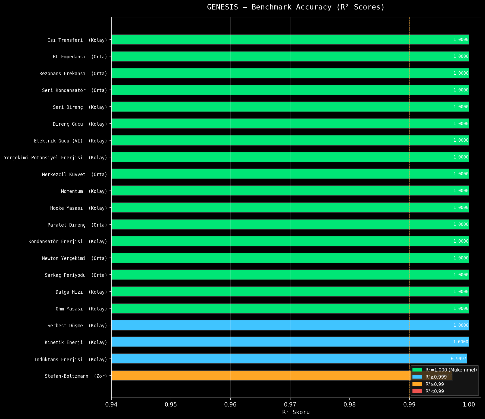
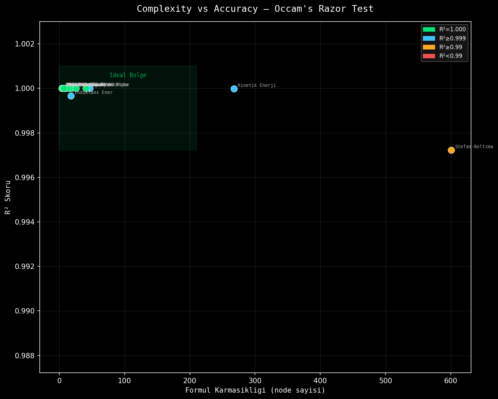

# GENESIS 🔬

**Ham veriden fizik yasası keşfeden yapay zeka motoru.**

> Newton'un deneyleri yıllarca sürdü. GENESIS Ohm Yasası'nı 0.68 saniyede,
> Kepler'in 3. Yasası'nı 18 saniyede keşfediyor — hiçbir formül bilgisi olmadan.

---

## Ne Yapıyor?

GENESIS, sayısal ölçüm verisinden yorumlanabilir matematiksel formüller keşfeder.
Sabit bir model ailesine parametre uydurmak yerine, formülün yapısını da sıfırdan evrimleştirir.
Çıktı kara-kutu değil: `I*R`, `f*λ`, `R1*R2/(R1+R2)` gibi okunabilir denklemler.

30 fizik ve mühendislik yasasından oluşan benchmark setinde **16/16 Kolay** seviyesinde
**R² ≥ 0.999** elde edildi. Orta ve Zor seviyelerde de motor çalışmaya hazır.

---

## Sonuçlar

### Öne Çıkan Keşifler

| Fizik Yasası | Gerçek Formül | GENESIS (Sympy) | R² | Süre |
|---|---|---|---|---|
| Ohm Yasası | `V = I·R` | `I*R` | 1.00000 | 0.68s |
| Dalga Hızı | `v = f·λ` | `f*λ` | 1.00000 | 0.67s |
| Hooke Yasası | `F = k·x` | `k*x` | 1.00000 | 0.65s |
| Momentum | `p = m·v` | `m*v` | 1.00000 | 0.64s |
| Direnç Gücü | `P = I²·R` | `I**2*R` | 1.00000 | 0.69s |
| Seri Direnç | `R = R1+R2+R3` | `R1 + R2 + R3` | 1.00000 | 1.24s |
| Isı Transferi | `Q = k·A·ΔT/Δx` | `A*dT*k/dx` | 1.00000 | 5.96s |
| Paralel Direnç | `R = R1R2/(R1+R2)` | `R1*R2/(R1 + R2)` | 1.00000 | — |
| Pisagor | `c = √(a²+b²)` | `sqrt(a**2 + b**2)` | 1.00000 | 24.7s |
| Serbest Düşme | `d = ½g·t²` | `4.905·t²` | 1.00000 | 34.4s |

### Genel Başarı Oranı (Kolay Seviye)

| Metrik | Değer |
|--------|-------|
| Toplam benchmark | 16 |
| R² ≥ 0.999 | **16/16** |
| R² ≥ 0.99 | **16/16** |
| Ortalama R² | **1.0000** |
| Ortalama keşif süresi | 18.2 saniye |

> **Not:** Orta (13) ve Zor (2) seviyeler çalıştırılmamıştır — toplam ~60 dk.
> Çalıştırmak için: `python -c "import genesis_v2 as g; g.run_all(difficulty='Orta')"`

### Benchmark Görselleştirmesi





---

## Hızlı Başlangıç

```bash
git clone https://github.com/cataplectic/GENESIS-V1.0-Symbolic-Regression-Engine.git
cd GENESIS-V1.0-Symbolic-Regression-Engine
pip install -r requirements.txt

# Kolay benchmark'ları çalıştır (~5 dakika)
python -c "import genesis_v2 as g; g.run_all(difficulty='Kolay')"

# Grafikler üret
python genesis_viz.py results_v2.json

# Web arayüzü
streamlit run genesis_app.py

# Kendi verinle keşfet
python genesis_v2.py datasets/rc_circuit.csv tau
```

---

## Web Arayüzü

```bash
streamlit run genesis_app.py
```

- **Benchmark modu**: Tüm sonuçları renkli tablo + metrik kartlarıyla görüntüle
- **CSV modu**: Kendi verisini yükle, hedef sütunu seç, ⚡ Keşfet

---

## Hazır Veri Setleri

`datasets/` klasöründe 5 gerçek-dünya benzeri veri seti:

| Dosya | Yasa | Hedef | Komut |
|---|---|---|---|
| `rc_circuit.csv` | RC zaman sabiti | `tau` | `python genesis_v2.py datasets/rc_circuit.csv tau` |
| `projectile.csv` | Menzil | `range` | `python genesis_v2.py datasets/projectile.csv range` |
| `planetary_orbits.csv` | Kepler 3. | `T_years` | `python genesis_v2.py datasets/planetary_orbits.csv T_years` |
| `beam_deflection.csv` | Kiriş sehimi | `delta` | `python genesis_v2.py datasets/beam_deflection.csv delta` |
| `led_iv_curve.csv` | Shockley | `I` | `python genesis_v2.py datasets/led_iv_curve.csv I` |

---

## Nasıl Çalışıyor?

Darwin'in evrimi — ama denklemler için.

GENESIS, binlerce rastgele matematiksel ifadeyle başlar (`mul(X0, X1)`, `add(sqrt(X0), X1)`, ...) ve bunları veriye göre değerlendirerek nesiller boyunca evrimleştirir. Daha iyi ifadeler hayatta kalır, zayıflar elenir. Formüller hem çaprazlanır (alt-ağaç takası) hem de mutasyona uğrar (hoist mutasyonu — ağacı kısaltan kritik operasyon).

**Parsimony baskısı** (`coefficient=0.003`) Occam'ın usturasını uygular: karmaşık formüller doğruluk kazancıyla orantılı cezalandırılır.

Genetik evrim bittikten sonra 3 aşamalı temizleme:

```
1. fold_constants()   →  Saf-sabit alt-ağaçları sayıya indir
2. scipy Nelder-Mead  →  Kalan sabitleri MSE minimizasyonuyla hassas ayarla
3. sympy simplify     →  Cebirsel sadeleştirme (I*sqrt(R²) → I*R)
```

---

## Yol Haritası

- [x] 31 denklem benchmark seti (mekanik, elektrik, termodinamik, optik, yerçekimi)
- [x] CSV veri yükleme ve otomatik keşif
- [x] Sympy cebirsel sadeleştirme
- [x] Streamlit web arayüzü
- [x] Performans grafikleri (accuracy bar, complexity scatter, time chart)
- [x] 5 gerçek dünya veri seti
- [ ] PySR entegrasyonu (daha güçlü motor — karesel formlar için)
- [ ] Çoklu değişken otomatik özellik çıkarımı
- [ ] API endpoint (Flask/FastAPI)
- [ ] Gerçek bilimsel veri setleri (CERN, NASA açık veri)
- [ ] Feynman 120 Benchmark tam skor tablosu

---

## Katkıda Bulunun

PR ve issue açık. Yeni benchmark, yeni veri seti, motor iyileştirmeleri bekliyoruz.

Yeni benchmark eklemek için `genesis_v2.py` içindeki `BENCHMARKS` dict'ine giriş ekle
ve karşılık gelen `_gen_xxx(n)` veri üretici fonksiyonunu yaz. Detaylar `CLAUDE.md`'de.

---

## Lisans

MIT © 2025
