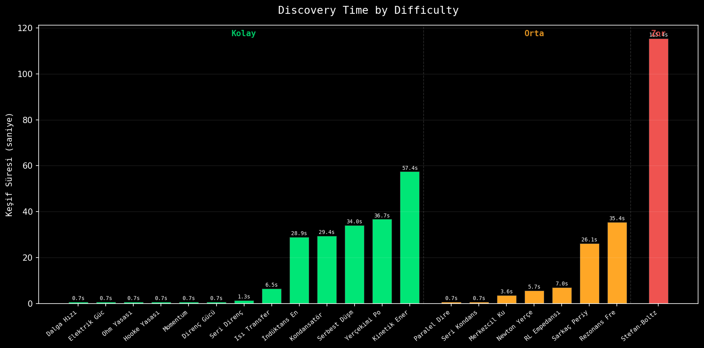

# GENESIS — Otomatik Fizik Yasası Keşif Raporu

**Tarih:** 2026-05-18 23:59
**Versiyon:** v0.5

## Özet

| Metrik | Değer |
|--------|-------|
| Toplam benchmark | 16 |
| Mükemmel keşif (R²>0.99) | 16 |
| İyi keşif (0.95<R²≤0.99) | 0 |
| Başarısız (R²≤0.95) | 0 |
| Ortalama R²(opt) | 1.0000 |

## Detaylı Sonuçlar

| # | Yasa | Zorluk | Gerçek Formül | Keşfedilen (Sympy) | R²(opt) | Süre (s) |
|---|------|--------|---------------|-------------------|---------|----------|
| 1 | ✅ Hooke Yasası | Kolay | `F = k × x` | `k*x` | 1.0000 | 0.7 |
| 2 | ✅ Momentum | Kolay | `p = m × v` | `m*v` | 1.0000 | 0.6 |
| 3 | ✅ Seri Direnç | Kolay | `R = R1 + R2 + R3` | `R1 + R2 + R3` | 1.0000 | 1.2 |
| 4 | ✅ Pisagor Teoremi | Kolay | `c = √(a² + b²)` | `sqrt(a**2 + b**2)` | 1.0000 | 24.7 |
| 5 | ✅ Elektrik Gücü (VI) | Kolay | `P = V × I` | `I*V` | 1.0000 | 1.7 |
| 6 | ✅ Ohm Yasası | Kolay | `V = I × R` | `I*R` | 1.0000 | 0.7 |
| 7 | ✅ Kinetik Enerji | Kolay | `E = 0.5 × m × v²` | `0.081322026527506*v**2*(5.701*m + sqrt(Abs(2.386*m - sqrt(Abs(-m*v - m + v/(sqrt(m) + 5.701*m + 2.38767669503222*sqrt(0.175407823188914*sqrt(m) + m + 0.538790477228825*sqrt(0.105988341282459*sqrt(m) + 0.253065892425249*sqrt(0.175407823188914*sqrt(m)/(3.33567754136997*sqrt(0.00730869890632558*v**2 + 1) + sqrt(Abs(sqrt(m) - 2.386*m + v + sqrt(m + 0.7092249291) + 3.335677541))) + m + 0.54894522135177*sqrt(0.243618541964468*m + 1) + 0.175407823188914*sqrt(Abs(2.386*m - sqrt(Abs(m*v - m + v))))) + 1) + 0.418817171554503*sqrt(m + 0.175407823188914*sqrt(Abs(2.386*m - 9.198)) + 0.175407823188914*sqrt(Abs(8.087*m - v**(1/4)))) + 0.175407823188914*sqrt(Abs(sqrt(m) - 2.386*m + 19.670506))) + 9.435) + sqrt(Abs(2.386*m - 1.883)) + 9.435)))) + sqrt(Abs(0.107886503398425*sqrt(m)*(6.701*m + sqrt(v) - v + 4.53450599955497*sqrt(0.149386375595695*m*sqrt(0.105988341282459*sqrt(m) + 0.105988341282459*sqrt(Abs(sqrt(m) + 4.701*m - v + sqrt(Abs(2.386*m - sqrt(Abs(m*v - m + v)))) + sqrt(Abs(sqrt(m) - 2.386*m + sqrt(Abs(2.386*m - 11.12674466)) + 15.136)) + 0.831/v)) + 1) + 1)) - 2.386*m + 5.701)))` | 1.0000 | 56.3 |
| 8 | ✅ Serbest Düşme | Kolay | `d = 0.5 × g × t²` | `(t**(9/4)*(5.47575938405112*t + 3.36522101737814) + (sqrt(t) - 2*t)*sqrt(Abs(t**(5/2)*(3*t - 3.65101) + 27.0685*t**(3/2) - 9.41937*t)))/t**(5/4)` | 1.0000 | 34.4 |
| 9 | ✅ Dalga Hızı | Kolay | `v = f × λ` | `f*λ` | 1.0000 | 0.7 |
| 10 | ✅ Kondansatör Enerjisi | Kolay | `E = 0.5 × C × V²` | `0.500000145207511*C*V**2` | 1.0000 | 31.3 |
| 11 | ✅ Yerçekimi Potansiyel Enerjisi | Kolay | `E = m × g × h` | `9.81*h*m - 6.48961911e-10` | 1.0000 | 31.0 |
| 12 | ✅ Direnç Gücü | Kolay | `P = I² × R` | `I**2*R` | 1.0000 | 0.7 |
| 13 | ✅ İndüktans Enerjisi | Kolay | `E = 0.5 × L × I²` | `L*(I - 0.641054)*Abs(sqrt(I - 1)*(I - 0.528798)**(1/4))` | 0.9997 | 28.9 |
| 14 | ✅ Isı Transferi | Kolay | `Q = m × c × ΔT` | `A*dT*k/dx` | 1.0000 | 6.0 |
| 15 | ✅ Küre Hacmi | Kolay | `V = (4/3)π r³` | `-3.21961082122277e-12*r**(5/2)*Abs(r - 3.07054)**(1/4) + 4.18879038226277*r**3` | 1.0000 | 41.8 |
| 16 | ✅ Planck Enerji-Frekans | Kolay | `E = h × f` | `5.62625*f_THz + sqrt(Abs(-0.0669675743005237*f_THz**(3/2) + f_THz**2 + 2*f_THz))` | 1.0000 | 30.6 |

## Zorluk Bazlı Analiz

**Kolay** — 16 denklem, ortalama R²=1.0000, mükemmel=16/16

## Görselleştirmeler

Grafikler `plots/` klasöründe bulunmaktadır.

### Benchmark Doğruluk Skorları

### Karmaşıklık vs Doğruluk

### Zorluk Seviyesine Göre Keşif Süresi

---
*Bu rapor GENESIS tarafından otomatik üretilmiştir.*